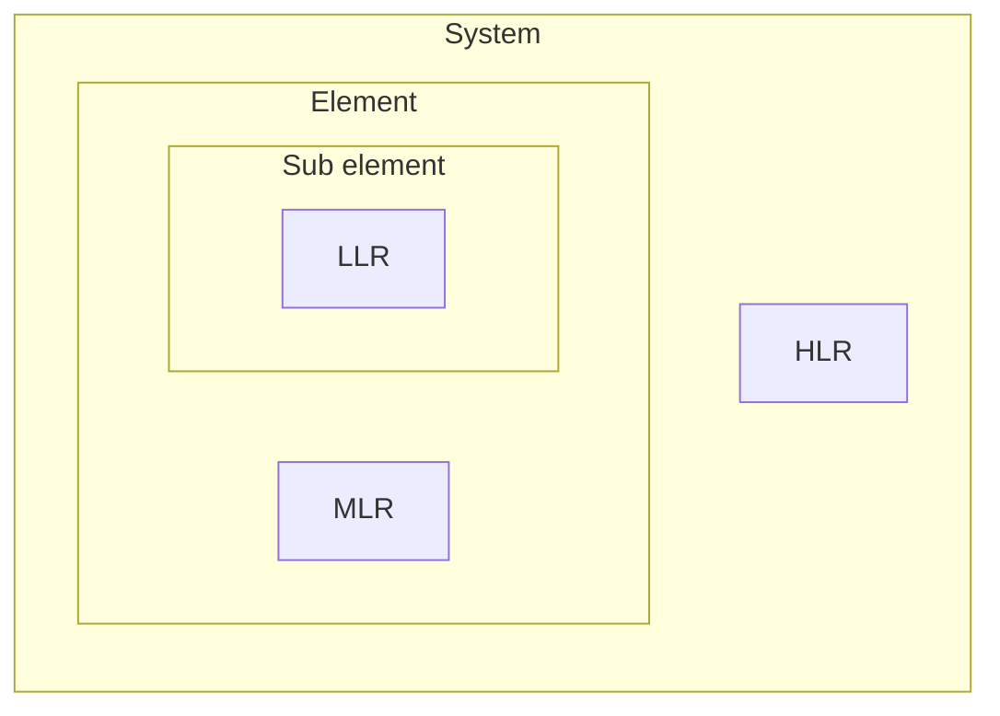

# Process as a System III: Internally consistent quality criteria for requirements in systems engineering

**Author:** Jan Frank

**Abstract: Successful systems engineering projects ... well formed requirements. This paper establishes a unique set of quality criteria for requirements. Through interpretation of quality criteria as requirements for requirements, a self verification results in internally consistent quality criteria.** 

**Keywords:** Systems engineering, Requirement, Analysis

## Introduction
### Requirements are subjective
### First principles thinking
### Requirements engineering
## Scope
### Requirements vs Needs
### Diagrams as requirements 
## Quality criteria for requirements

### Requirements for requirements
Quality criteria are requirements for requirements
To make this more readable, quality criteria is used as a qualifier of an individual requirement entry.

### Internal consistency through self verification
Since quality criteria are requirements for requirements, in the end all requirements should adhere to the complete set of quality criteria.

### Development process
The process will iterate through the requirements based on a PDCA cycle. Each iteration will increase the quality and therefore the confidence in the requirements. The initial "Iteration 0" will only integrate the source material into the requirements as-is and select and adjust the quality criteria for the next iteration based on intuition. 

**Plan:** Elicit requirements and ensure they conform to the quality criteria.
Thats obvious and does not need to be repeated.

**Do:** Elicit requirements
Try to understand the requirements, get more background information and then refine the requirement.
Used background information might be dictionaries like the Oxford English Dictionary (OED), Merriam Webster Dictionary (MWD), and the Cambridge Dictionary (CD).

**Check:** Review the elicited requirements using the selected quality criteria

**Act:** Adjust the used set of quality criteria for the next iteration

## Iterations
### Iteration 0
#### Atomic requirements
The requirement chosen for the creation of the first quality criteria within the initial iteration is the "atomic" requirement. This selection, purely based on intuition, focuses on structural aspects of requirements, which should hopefully be more agreeable than content based aspects.

> Atomic: self-contained and capable of being understood independently of other requirements or designs. [^BaBOK] p.143

The term atomic in its philosophical meaning originates from latin and greek and translates to "indivisible". [^Etym] //Introduce Atomism, Atomic theory. The description of the cited requirement does not support that meaning.

Applying the term as a quality criterion would imply that well formulated requirements are not further dividable. This is not a reasonable objective for requirements development which deals with decomposition of the system to its elements and sub elements. A high level requirement for a system element is just as valid as a more detailed requirement for its sub elements. Even more, deconstructing all requirements solely into atomic requirements would make it hard to understand the context establish by un-atomic requirements.

Literature offers mostly circular or deflecting definitions of atomic requirements.

In summary atomic requirements are not desirable and the term atomic is only loosely defined. But there are potentially underlying aspects of atomicity that may still be relevant for requirements development.

#### Atomicity

Atomicity in computer sciences refers to an action that, although composed of primitive steps executed at different times and in different places, are not allowed to be decomposed. Atomic actions are a solution regarding conflicting changes of shared information or incomplete changes of critical information. Shared information may be changed by concurrent execution paths and depending on the timing of the change, execution results may differ. Incomplete changes to critical information may be a result of failures within the execution.[^Reed] p.4-6 What is important to recognize is that this type of atomicity is not an inherent property, but one that is added to those specific actions to avoid the issues as mentioned previously. The state of the art method to ensure atomicity of changes to requirements is to add them to a version control system, which implements synchronization points between atomic changes and allows for reverting to a previous version in case of failure.
- Versioned: A requirement shall be version controlled to avoid conflicting, concurrent changes and be able to revert in case of failure.

#### Independence
While "self-contained and capable of being understood independently"[^BaBOK] p.143 are candidates for additional quality criteria, they can not be deduced from the objectives or needs regarding atomicity.

While making actions atomic are one solution, avoidance of shared information or failure is another.
In order to avoid shared information between requirements each has to exist only once within the 
- Independent: A requirement shall define expectations independent of external information.
- Specific: A requirement shall define expectations specific for the system element or relationships.
- Singular: A requirement shall be defined only once within the set of valid requirements.
- Consistent: A requirements shall be consistent with the expectations of all other system requirements.

Since failure can not be reasonably avoided, the quality criteria need to integrate an synchronization point similar to a resource lock.

Going back to race conditions, the case of shared information. When multiple requirements define the same system element there is a risk of conflict between those expectations.

#### Relevant requirements
### Iteration 1
- Avoid Multiplicity of system element or relationships
- Multiplicity of expectations
- Context specific
1. Plan:
2. Do:
3. Check:
4. Act:
### Iteration 2
### Iteration 3
## Summary
## References
[^BaBOK] p.143
[^IREB] p.65
[^WiegersBeatty] p.204

[^BaBOK]: A Guide to the Business Analysis Body of Knowledge® v3, International Institute of Business Analysis, 2015
[^IREB]: Handbook IREB CPRE Foundation Level - Version 1.1.0, International Requirements Engineering Board, 2022
[^WiegersBeatty]: Software Requirement Third Edition, Karl Wiegers and Joy Beatty, 2013
[^Reed]: Implementing Atomic Actions on Decentralized Data, David P. Reed, 1983
[^Etym]: atom (n.)